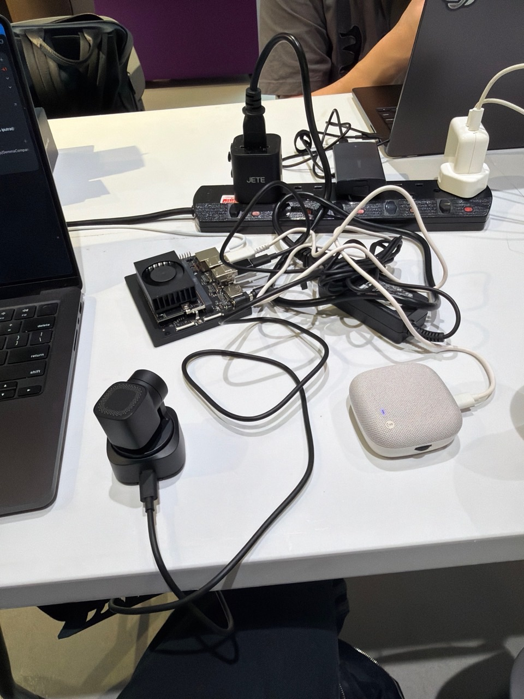
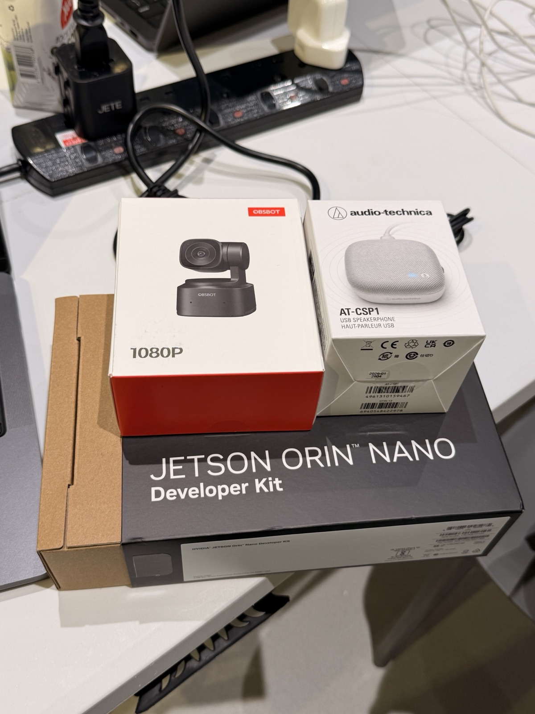

# Gemma Companion

**An on-device AI companion that can see, hear, speak, and look for itself.**

> When Gemma does not know, it does not ask you for another picture. It looks.

<p align="center">
  
  
</p>

- **Embodied vision:** ask Gemma to look left or right, describe what it sees, read a label, or assess a scam message.
- **Elderly-friendly finding:** ask for a missing object and Gemma searches the room, then reports a grounded location or honestly says it could not find it.
- **Private edge AI:** speech, vision, reasoning, camera control, and voice synthesis run on one 8 GB Jetson without a cloud API.

Built for **Best Use of Gemma** (primary) and **Best Elderly Hack** (secondary).

## How a conversation works

At boot, the Jetson starts the companion, centers the camera, inspects a fresh frame, and says **“Hi, I'm Gemma!”** when it is ready. There is no wake word.

1. Unmute the Audio-Technica microphone, speak, and mute again to close the turn.
2. Local `whisper.cpp` converts the temporary utterance into text, then deletes the WAV.
3. Gemma decides whether to answer, move the camera, inspect a fresh view, or search the room.
4. The OBSBOT acts and captures discrete stills only when the selected tool needs them.
5. Gemma grounds its answer in the action or image, and Kokoro speaks it through the AT-CSP1.

For a find request, the OBSBOT first establishes a level pose, then checks overlapping views and waits for the gimbal to settle before judging each image. On detected voice onset, current playback is cancelled promptly so the newest request can redirect the companion. Normal use requires no Mac, terminal, Wi-Fi, or cloud connection.

## Architecture

```text
AT-CSP1 microphone
        ↓ 16 kHz speech
whisper.cpp → transcript
        ↓
Gemma 4 semantic + tool gate
        ├─ answer normally
        ├─ look_* → OBSBOT physically moves
        └─ inspect/find → fresh JPEG → Gemma vision
        ↓
Kokoro-82M → AT-CSP1 speaker
```

Gemma is the essential reasoning layer: it interprets unfamiliar wording, chooses registered tools, reasons over fresh images and directional memory, and decides when enough visual evidence exists. Movement is bounded and tool results are checked before Gemma describes success.

## Hardware

| Part | Role | What it does |
|---|---|---|
| **NVIDIA Jetson Orin Nano 8 GB** | Brain | Runs Gemma with CUDA plus Whisper, Kokoro, device control, and local logs. |
| **OBSBOT Tiny SE** | Eyes and neck | Captures fresh stills and physically pans or tilts under Gemma-selected UVC tools. |
| **Audio-Technica AT-CSP1** | Ears and voice | Provides the USB microphone, speaker, physical mute button, and hardware volume. |
| **500 GB Transcend NVMe** | Local storage | Holds Ubuntu, runtimes, model assets, captures, and evidence logs. |

The accepted system uses JetPack 6 / Ubuntu 24.04, L4T R39.2.1, Python 3.12, OBSBOT capture on `/dev/video0`, and the AT-CSP1 ALSA alias `Device`. Other hardware and device aliases are not yet verified. See [the exact reconnaissance](docs/recon.md).

## Quick start

Setup needs internet access once; normal use is offline. Start with a JetPack 6 system with CUDA and the packages listed in the [complete setup guide](docs/SETUP.md), then run on the Jetson:

```bash
git clone https://github.com/ilhamfp/GemmaCompanion.git ~/gemma-companion
cd ~/gemma-companion
./scripts/recon.sh
./scripts/bootstrap_runtime.sh
./scripts/bootstrap_tts.sh
make runtime
make companion
```

Keep the AT-CSP1 muted until Gemma says `Hi, I'm Gemma!`, then use the rhythm **unmute → speak → mute**.

For automatic startup after every power-on, install and verify the service once:

```bash
sudo ./scripts/install_boot_service.sh
./scripts/test_boot_service.sh
```

The installer adds the systemd unit and a narrowly scoped sudoers rule that permits only restarting `gemma-companion.service`. Connect the OBSBOT and AT-CSP1 before applying power. See [SETUP.md](docs/SETUP.md) for prerequisites, hardware verification, configuration, updates, and troubleshooting.

## Try it

The primary live experience is `make companion`. Natural paraphrases go through Gemma rather than an exact-phrase command router. For example:

- “Look left and tell me what you see.”
- “What color is the object I am holding?”
- “Find my AirPods.”
- “Read this message. Is it a scam?”
- “Make your voice louder.”

The original bounded acceptance demos remain available:

```bash
make demo-akinator                    # live voice Akinator
make demo-akinator DEMO_ARGS=--text   # keyboard fallback
make demo-elderly                     # fixed text finder acceptance target
```

`make demo-elderly` reproduces the verified Audio-Technica-speaker target. Use `make companion` for a live voice request to find AirPods or another visible object. Follow the [no-Mac runbook](docs/LIVE_COMPANION.md) for physical operation and the [five-beat demo flow](docs/DEMO_FLOW.md) for the presentation.

The accepted AirPods test completed a real camera sweep and grounded the case **near a laptop in 35.153 seconds**. Search favors reliable, settled images over fast in-motion captures.

## Why Gemma fits on the edge

The accepted model is **Gemma 4 E2B instruction-tuned QAT Q4_0**, served by the OpenAI-compatible `llama-server` bundled with Ollama 0.32.15 and its JetPack 6 CUDA backend. The 3.10 GiB text model plus 942 MiB multimodal projector fit the 8 GB device because of the E2B 4-bit quantization. Gemma handles text reasoning, image understanding, and physical tool selection; Whisper performs speech recognition and Kokoro produces speech.

Measured on the accepted Jetson—not cloud estimates or latency guarantees:

| Operation | Measured latency |
|---|---:|
| Real speech → local transcript | 1.315 s |
| Gemma text → text | 0.301 s |
| Live 1024 px image → text | 1.861 s |
| Transcript → physical PTZ | 0.869 s |
| Agentic fresh visual answer | 4.289 s |
| Dynamic answer → first audio | 1.108 s |
| Live AirPods search → grounded location | 35.153 s |

The production service retained 2.220 GiB available memory and refuses model inference below a 500 MiB guard. See [STATUS.md](docs/STATUS.md) for verbatim milestone evidence, [progress.md](docs/progress.md) for the command history, and [memory-budget.md](docs/memory-budget.md) for full measurements.

## Privacy, safety, and limits

- Runtime inference and device control stay on the Jetson after setup; there is no cloud API.
- Raw audio is processed in memory. A detected utterance becomes a temporary WAV for Whisper and is deleted after transcription.
- Boot- and tool-triggered JPEGs, transcripts, and session events remain local but persist in `captures/` and `logs/` until removed. There is no continuous video stream.
- PTZ is bounded to ±120° pan and ±30° tilt. The finder uses a bounded five-pose sweep with overlapping tabletop views; fully hidden, heavily occluded, or out-of-range objects can still produce an honest not-found answer.
- Elderly mode locates objects only. It does not provide medical advice, dosage or timing guidance, diagnoses, or emergency claims; it refers those requests to a caregiver or doctor.

## What was live, staged, and experimental

**Live:** Gemma inference, fresh OBSBOT captures, model-selected tool calls, physical camera motion, spoken answers, object locations, and local logging.

**Staged:** recognizable room objects and the example scam SMS. No model output or tool action is replaced by a prerecorded response. The repeatable Akinator verifier used a scripted truthful text respondent while Gemma's questions, vision, movement, guesses, speech, and logs remained live.

**Honest fallbacks:** the original M7 target became the visible Audio-Technica speaker when glasses could not be staged inside the useful sweep; the generic finder still accepts other objects. Native Gemma audio completed a real embodied find in 32.368 seconds, but safe CPU-projected vision is too slow and mixed GPU audio/vision can exhaust 8 GB CUDA memory, so the reliable service uses local Whisper. Kokoro is the accepted voice; eSpeak NG remains only a warning-logged fallback.

## Documentation

| Guide | Purpose |
|---|---|
| [SETUP.md](docs/SETUP.md) | Fresh installation, verifiers, configuration, updates, and troubleshooting |
| [LIVE_COMPANION.md](docs/LIVE_COMPANION.md) | Power-on behavior, physical mute workflow, and recovery |
| [DEMO_FLOW.md](docs/DEMO_FLOW.md) | Rehearsed five-beat live presentation |
| [CONTINUOUS_COMPANION.md](docs/CONTINUOUS_COMPANION.md) | State machine, barge-in, thresholds, and native-audio experiment |
| [STATUS.md](docs/STATUS.md) | Verbatim acceptance evidence and disclosed fallbacks |

Model weights and generated captures, artifacts, and logs are excluded from git. Downloaded models and runtimes retain their upstream terms.

## License

Application code is released under the [MIT License](LICENSE). Kokoro-82M is Apache-2.0 and `kokoro-onnx` is MIT-licensed. [Gemma](https://ai.google.dev/gemma/terms), Ollama/llama.cpp, whisper.cpp, its model, and eSpeak NG retain their respective upstream licenses and are not covered by the application's MIT license.
